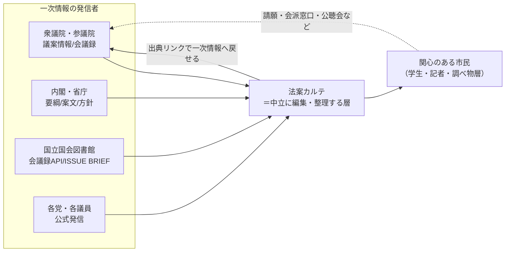

# サービス設計書 — 法案カルテ（Bill Dossier）

> このファイルは会話を通じて随時更新する生きたドキュメントです。
> 最終更新: 2026-06-11（初版・`/new-service` により生成）

---

## 0. 前提（バリューチェーンとステークホルダー）

このサービスは「お金が流れる取引構造」ではなく、**情報が流れる構造**の中に座る。一次情報の発信者と、判断材料を求める市民の「あいだ」に立ち、中立に整理し直すレイヤー。当面、金銭の授受は発生しない（無料で提供）。

- **発信者（上流）**: 国会（衆参）、内閣・省庁、国立国会図書館、各党。いずれも一次情報を無償公開している（一部はAPI/オープンデータ）。
- **編集層（本サービス）**: 一次情報だけを材料に、固定テンプレで中立整理。結論は出さず、必ず出典へ戻せるようにする。
- **読者（下流）**: 「判断材料は欲しいが、報道の論調にも陰謀論にも与したくない」関心層。金銭の対価はなく、得るのは「自分で判断できる状態」。
- **金銭の線**: 現状どこにも引かれない（無料運用）。将来の選択肢は §8 に列挙。

ターゲット候補（関心市民）は、選挙期のボートマッチや報道では満たされない「**通年で、個別法案を、一次情報ベースで把握したい**」という未充足ニーズの上に座っている（§7 で競合と対比）。

---

## 1. サービスの目的

重要な法案について、**ニュースの論調ではなく、国会・各党・省庁の一次情報だけ**を材料に、いま何がどう変わろうとしているのかを中立に整理する。前提となる現行法から、課題・改正点・各党の立場・審議の段取りまでを固定テンプレ（カルテ）に落とし込み、**読んだ人が自分で判断できる状態**を作ることが目的。

- 賛否の推奨・採点・勝敗予測はしない。判断は読者に委ねる。
- すべての記述に出典番号を付け、一次資料へ直接たどれるようにする。
- 「完全な中立は構造的に不可能」であることを隠さず明示する（→ §6 / 方針と限界ページ）。

背景: 法案は報道では論調込みで断片的に伝わり、一次情報（議案情報・会議録・要綱）は正確だが分散していて読みにくい。その間を埋める「中立な見取り図」が不足している。

---

## 2. ターゲットユーザー

**主たる層**: 政治・政策に関心はあるが、報道の偏りにも SNS の陰謀論にも与したくない一般市民。「自分で材料を見て判断したい」が、官庁サイトは難しくて続かない、という人。

**副次的な層**:
- 学生・教育現場（公民・主権者教育の教材）
- 記者・ライター（一次情報の所在を素早く把握する起点）
- 特定法案の当事者・関係者（自分に関わる改正を正確に知りたい）

**特徴**: 選挙期だけでなく**通年**で需要がある（法案は会期ごとに動き続ける）。既存の選挙ツールが手薄な領域。

---

## 3. 主な機能

### トップ＝今国会ダッシュボード
- 会期クロック（開会〜会期末、残り日数、現在地）
- 閣法の提出／成立件数（内閣法制局ベース）
- 衆参の議席（会派）構成バー＋過半数・3分の2ライン、二院制の関門の説明
- 「読む前の前提」（提出→委員会→本会議→もう一院→成立→公布の流れ）
- 審議中の注目法案カード一覧 → 各カルテへ
- 一次情報の所在ディレクトリ（法案を追う／審議を見る／条文・制度／人と党）

### 法案カルテ（固定テンプレート）
各法案を同一構成で整理（プロトタイプ確定）:
1. 前提となる現行法・現行体制
2. 何が課題とされているか
3. こう変わる（現行↔改正後の対比＋影響）
4. 主な論点／各党の立場（発信元ラベル付き）
5. 会期と採決までの道のり（ステッパー）
6. これまでの経緯（タイムライン）
7. 設計・方向性の選択（なぜこの形か）
8. よくある声と、この法案の射程（射程内/外の地図）
- ◇ 参加の経路（任意・呼びかけではない）
- ◇ 出典（一次情報・番号から直リンク）

### 共通ページ
- **参加の経路**: 請願／各党窓口／公聴会・参考人／パブコメ（多くの法案で対象外であることの明示）／地方議会の意見書
- **方針と限界**: 何をする/しないサイトか、中立性の5つの限界、事実と意見の線引き、出典ポリシー、更新と誤りの扱い

---

## 4. 画面・UI のイメージ

**プロトタイプ7枚（`files/` 内）がそのまま設計基準**。デザインは確定済みとして踏襲する。

- 配色: 紙色ベース（`#FBFAF6`）、インディゴ基調（`#28406E`）、オークル差し色。"registry / dossier（台帳・カルテ）" の落ち着いたトーン。
- 書体: 見出し Noto Serif JP、本文 Noto Sans JP、数値・ラベル Roboto Mono。
- レスポンシブ対応済み（640px 前後でカラム→1列）。
- 既存ファイル: `index.html`（トップ）、`bousai.html`/`seijishikin.html`/`spy.html`/`kokumin-touhyou-kaisei.html`（カルテ4本）、`genkai.html`（方針と限界）、`sanka.html`（参加の経路）。

実装時はこの HTML を Next.js のコンポーネント＋共通レイアウトへ移植し、カルテ本文を構造化データ/MDX として分離する（§8）。

---

## 5. データについて

### 5-1 / 5-2 / 5-3. データソースと取得方法・更新頻度

| 用途 | ソース | 取得方法 | 更新頻度 | 区分 |
|---|---|---|---|---|
| 質疑の全文（誰が何を言ったか） | NDL [国会会議録検索API](https://kokkai.ndl.go.jp/api.html) | **JSON/XML API・登録不要・無償**（NDLコンテンツ利用規約準拠） | 随時 | 事実(ソース) |
| 法案メタ（提出者・委員会・状況・党派別賛否） | [スマートニュース 国会議案DB](https://smartnews-smri.com/research/research-1127/) | **CSV/JSON・MIT・GitHub**（衆参20年分・約1.8万件） | 一括（**現行国会のカバー状況は要確認**） | 事実(ソース) |
| 現国会の最新の審議状況・経過 | [衆議院 議案情報](https://www.shugiin.go.jp/internet/itdb_gian.nsf/html/gian/menu.htm) / [参議院 議案情報](https://www.sangiin.go.jp/japanese/joho1/kousei/gian/) | 低頻度スクレイピング（負荷に配慮・規約要確認） | 会期中 週1程度 | 事実(ソース) |
| 条文の新旧（現行→改正後） | [e-Gov 法令検索](https://laws.e-gov.go.jp/) / 法令API | API/参照 | 随時 | 事実(ソース) |
| 法案本文・要綱・案文・提案理由 | 衆参 議案情報、内閣官房・各省庁ページ | **AIが下書き→AI検証→人間は最小ゲート**（§6・L2/L3） | 審議の節目ごと | 事実→要約 |
| 論点の整理 | 国立国会図書館 ISSUE BRIEF（調査と情報） | 参照・引用 | 公開時 | 整理(発信元明示) |
| 会派別議席数 | [衆議院](https://www.shugiin.go.jp/internet/itdb_annai.nsf/html/statics/shiryo/kaiha_m.htm) / [参議院](https://www.sangiin.go.jp/japanese/joho1/kousei/giin/current/giinsu.htm) | 参照 | 変動時 | 事実(ソース) |
| 閣法の提出・成立件数 | [内閣法制局](https://www.clb.go.jp/recent-laws/) | 参照 | 随時 | 事実(ソース) |

**ダッシュボードの数値**（会期残日数・成立件数・議席）は §6 のレーン1として**自動取得・自動更新**（人を外す）。**カルテ本文は審議の節目（審議入り・修正・採決・成立）ごと**に、変更検知（§6-2.5）が拾った差分を起点に更新し、各ページに「記載時点」を明記する。

### 5-4. 対象範囲（スコープ）
- **MVP**: 進行中の国会（現在は第221回）の**注目法案 数本**＋トップのダッシュボード＋共通2ページ。プロトタイプの4本（防災庁設置／政治資金規正法改正／スパイ防止／国民投票法改正）が出発点。
- 全法案網羅は目指さない。**関心が高く・論点が明確な重要法案に絞る**（編集コストと品質を両立させるため）。

### 5-5. データ実在性チェック結果（2026-06-11 実アクセス確認・GO）
- **NDL会議録API**: ✅ JSON正常稼働。発言単位で発言者/院/会議名/日付/本文/会議録URLを取得でき、直近 2026-06-03 の審議まで実データあり。
- **スマートニュース議案DB**: ✅ bot により**毎日更新**（最新コミット 2026-06-10）。現行国会を日次カバー。当初の「カバー範囲要確認」は解消。
- **衆参サイト robots.txt**: ✅ 両者とも404（クロール禁止の宣言なし）。低頻度・負荷配慮なら技術的障害なし。
- **残る確認（実装時）**: e-Gov法令APIの仕様確認、各サイトの利用規約本文（著作権は§9で確認済み・40条/13条で良好）。

---

## 6. 制作・検証パイプライン（＝編集ポリシー）

このサービスは**判定・スコア化をしない**。ロジックの中身は「中立に正確に整理するための制作・検証ルール」。`genkai.html`（方針と限界）を運用基準として固定する。

### 6-0. 設計思想：「人間 vs AI」ではなく「3レーン」

内容を2種類に分け、誤りの源泉に応じて扱いを変える。
- **決定論的な事実**（日付・件数・議席・審議状況）: 人もAIも判断を挟むと、転記ミス・更新忘れ・幻覚という誤りを**増やす**。→ 機械的に取得・描画し、人を外す。
- **自然言語の統合**（課題の立て方・各党の立場・要約・射程の選定）: ここに幻覚・誤帰属・偏りのリスクと、信頼のモートが集中する。→ AIに書かせたうえで検証で縛り、人間の関与を「裸の判断」から「束縛された照合」に作り変える。

### 6-1. 3レーン

| レーン | 対象 | 制作 | 検証 | 人間の関与 |
|---|---|---|---|---|
| **L1 機械的** | ⑤会期・採決状況、⑥経緯の日付、ダッシュボード全数値、議席 | API/構造化データから自動取得 | スキーマ検証（型・範囲） | **なし**（出典＋更新時刻つきで自動描画・自動更新） |
| **L2 AI下書き＋AI検証** | ①現行法、③現行↔改正後など**一次資料に1対1で対応づく事実散文** | AIが「主張＝出典の束縛」形式で下書き | 2台目AIが引用元と含意照合＋中立リント | **フラグの立った文だけ**確認。フラグ0なら自動公開可 |
| **L3 AI下書き＋人間が最小ゲート** | ②課題の立て方、④各党の立場の帰属、⑦⑧の選定（＝判断が入る箇所） | AIが下書き | 同上＋偏り検査 | **新規カルテの公開時のみ**4項目チェックリスト（§6-3）。更新は変更検知が「物語の実質変化」を出した時だけ再ゲート |

### 6-2. 人間チェックを縮小・明確化する技術

1. **主張＝出典の束縛（claim-citation binding）**: 事実文は必ず「根拠の一次資料URL＋引用スニペット」とセットで出力させる。人間の仕事は「世界で正しいか（無限）」ではなく「引用スニペットと一致するか（有限）」に縮む。
2. **危険な部分は要約せず引用（extractive）**: ④各党の立場はパラフレーズをやめ、会議録のほぼ逐語引用にする（著作権法40条で自由利用可）。誤帰属がほぼ消え、残るのは選定バイアスのみ。
3. **敵対的チェッカー（2台目AI）**: 下書きを独立に検証し、無根拠な文・誤引用・断定/誘導語・立場ブロックの長さ/位置の不均等を**フラグのリスト**として出力。人間は例外だけ見る。
4. **中立リント（コードによる機械検査）**: 推奨動詞の不在、「射程外」行への留保文の必須、立場ブロックの文字数が互いにX%以内、などを自動検査。
5. **更新の変更検知**: 議案情報/会議録APIを定期ポーリングし前回スナップショットと差分を取る。ステータス変化→L1事実を自動更新、散文が要改訂なら該当箇所にフラグ。

### 6-3. 残す人間ゲート（新規カルテの政治的帰属の公開のみ）

理由: 信頼がこのサービスの唯一のモートで、誤帰属1件のバズが不可逆に壊す。AI検証はAIの幻覚と**相関した誤り**を犯すため、政治的帰属の最終確認は独立した人間に残す。ただし作業は4項目に限定する。
1. フラグの立った帰属が、引用スニペットと一致しているか
2. 各立場が発信元ラベルつきで、長さ・位置が均等か
3. 「射程外」に留保が付いているか
4. 推奨・誘導表現が混入していないか

これにより人間の作業は「半日のリサーチ＆執筆」から「フラグ5〜10件の照合＝15〜30分」へ縮む。

### 6-4. 不変の原則（レーンを問わず）

- **一次情報限定**: 国会の議案/会議録/審査会資料、各党の公式発信、省庁資料を優先。報道は原則材料にしない（速報的事実を補助に使う場合は明記し、確定は一次資料で）。
- **事実と意見の線引き**: 地の文は検証可能な事実として書く。賛否にあたる見解は必ず「どの会派・どの主体が述べたか」を明示し、運営の評価を混ぜない。
- **「射程外＝安全」と読ませない**: 射程外の懸念でも、未措置の宿題・別制度・設計上の論点として残るものは区別して添える。
- **要約は劣化コピー**: 平易な要約は入口で、正確さは一次資料が担保。重要判断は原典に当たるよう促す。
- **やらないこと**: 賛否推奨・投票誘導／採点・ランキング／成立可否の勝敗予測／個別の法的助言／世論調査。

---

## 7. 競合・類似サービス

| サービス | 主軸 | 本サービスとの違い |
|---|---|---|
| [JAPAN CHOICE / NPO法人 Mielka](https://japanchoice.jp/) | 選挙期のボートマッチ・政策比較・投票ナビ | あちらは**選挙×政党/候補者マッチング**が中心。本サービスは**通年×個別法案**を追う |
| NHK / 日経 ボートマッチ | 選挙期の政党マッチング | 同上。選挙イベント連動で、法案単位の継続的整理ではない |
| 政治ドットコム | 政治ニュース＋制度のわかりやすい解説 | ニュース／一般解説寄り。**一次情報限定・固定テンプレ・出典直リンク**ではない |
| [スマートニュース 国会議案DB](https://smartnews-smri.com/research/research-1127/) | 議案メタの**オープンデータ**（CSV/JSON） | 生データの提供。**読んで判断できる編集レイヤーは無い** → 本サービスの素材として活用できる |

**差別化（4点）**: ①通年で個別法案を追う ②一次情報だけを材料 ③全法案を同一の固定テンプレ（カルテ）で ④結論を出さず判断は読者に委ね、限界を自己開示する。この組み合わせを満たすサービスは現状不在。

---

## 8. 公開・運用方針

### 技術スタック（確定: 静的サイト・DBなし）
- **Next.js（静的中心）+ Vercel 無料枠**。ユーザー登録・コメント等の UGC が無いため**データベース不要**（標準スタックの Supabase は今は入れない）。
- **コスト実質ゼロ／APIキー課金リスクなし／個人情報を持たないため漏洩リスクほぼゼロ**。「無料で作り無料で提供」と完全に整合。
- **カルテ＝構造化データ/MDX で管理**し、「カルテ追加＝ファイル追加」にする。テンプレ（§3）に沿った型を1つ用意し、各文は「テキスト＋出典＋引用スニペット」を持つ構造にして §6 の検証パイプラインに乗せる。
- データ取得（会議録API・議案DB・スクレイプ）は**ビルド時 or 定期ジョブで取り込む**スクリプト（Python/TS）として分離。フロントから外部DB/APIを直接叩かない。
- **制作・検証パイプライン**（§6）も独立スクリプト群として実装：①L1自動取得→描画、②AI下書き、③AI検証＋中立リント（フラグ出力）、④変更検知。人間ゲートはフラグ付き差分のレビューUI（最小）。

### 運用
- ダッシュボード数値は会期中 週1程度更新、カルテは審議の節目ごと。各ページに「記載時点」を明記。
- 誤りは訂正し、更新履歴を残す（方針ページに準拠）。

### 収益化（当面なし／将来の選択肢のみ）
- 当面は完全無料・広告なし（中立性の信頼を最優先）。
- 将来の選択肢（採用しても中立性を損なわない範囲で）: 寄付・サポーター、教育機関向けの教材提供、API/データの二次提供など。**いずれも現段階では検討対象外**。

---

## 9. 未決事項・次のステップ

### 公開前に詰める
- **法的留意**: 出典・引用の適正範囲、会議録等の二次利用条件、名誉毀損・政治的公平への配慮、運営者表示（特商法的な表記の要否）、免責の明記。
- **データ規約**: 各ソースのスクレイピング可否・頻度、スマートニュースDBの現行国会カバー状況（§5-5）。
- **コンテンツ供給ペース**: 3レーン＋検証パイプライン（§6）で、人間ゲートを15〜30分/本まで縮められるか。検証パイプライン（claim-citation束縛・敵対的チェッカー・中立リント）の実装コストと精度の見極め。MVP掲載法案の選定基準。
- **ダッシュボード鮮度**: L1の自動取得をMVPからどこまで入れるか（最初は手動でも可、ただし「更新時刻」表示は必須）。
- **検証AIの相関誤りの限界**: AI検証はAIの幻覚を完全には潰せない（§6-3）。新規カルテの政治的帰属に人間ゲートを残す前提を、運用しながら緩められるか検証。
- **更新・訂正の運用**: 「記載時点」表示と更新履歴の置き方。

### 次のステップ（ユーザー標準フロー）
1. ~~`/validate-service`~~ — 完了（総合評価「○ 条件付きで進める」。最大リスクは編集コスト→§6の3レーン化で対処）
2. `/ux-design`（Phase 1.5）— 動線設計・プロトタイプ評価（既存HTMLが土台）
3. `/tech-design`（Phase 2）— 技術設計（Next.js移植・データ取込スクリプト・§6検証パイプライン・カルテのデータ構造）

---

## 更新履歴

- 2026-06-11: 初版作成（`/new-service` コマンドにより生成）。プロトタイプ7枚の読解＋データソース/競合調査＋ユーザー確定事項（AI下書き＋人確認／静的サイト・DBなし）を反映。
- 2026-06-11: `/validate-service` 完了（総合「○ 条件付きで進める」）。§6を「人間チェック最小化」方針で**3レーン＋検証パイプライン**モデルに改訂（L1機械的＝人を外す／L2 AI下書き＋AI検証／L3 新規カルテの政治的帰属のみ人間4項目ゲート）。§5・§8・§9を整合。
